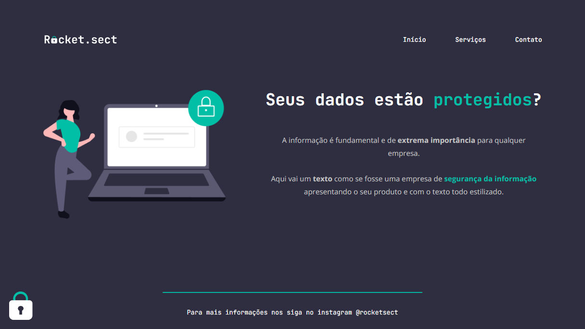

# Stage 02 - Challenge 02

### Projeto desenvolvido no nível 02 do programa de formação Explorer da Rocketseat.

## 📝 **Conceitos trabalhados**

**Outros conceitos de HTML e CSS:**

- Tags semânticas;
- Conceito de Box model;
- Conceito de Flexbox;
- Introdução a acessibildiade;
- Utilização da ferramenta DevTools do navegador.

#### 👉🏽 Clique **[aqui](https://eduardofariasdev.github.io/stage02-challenge02/)** e abra esse projeto no seu seu navegador.
